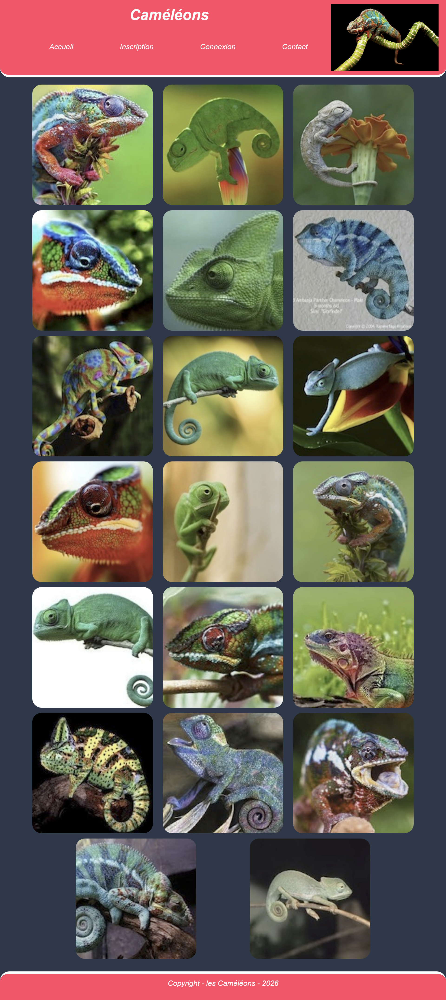
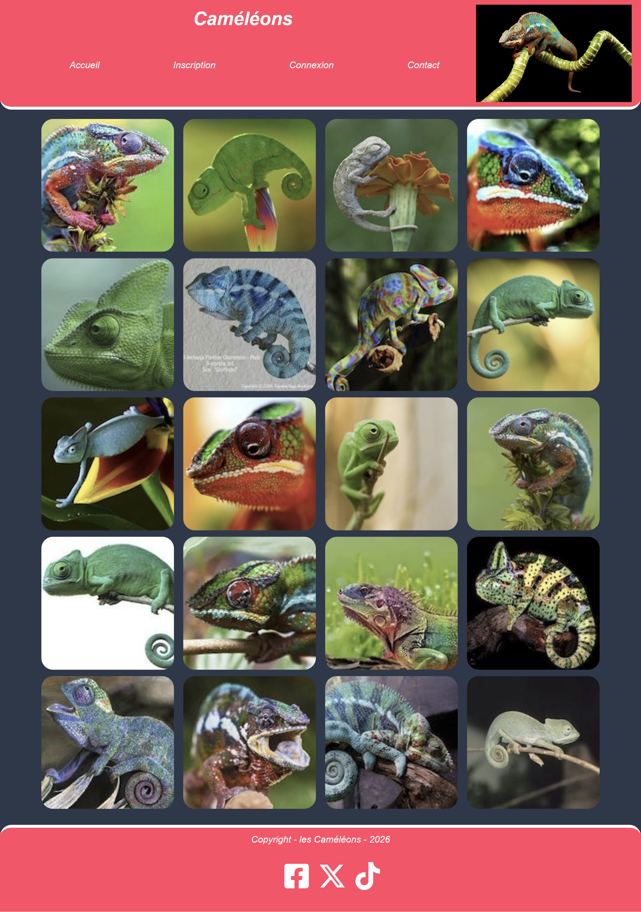
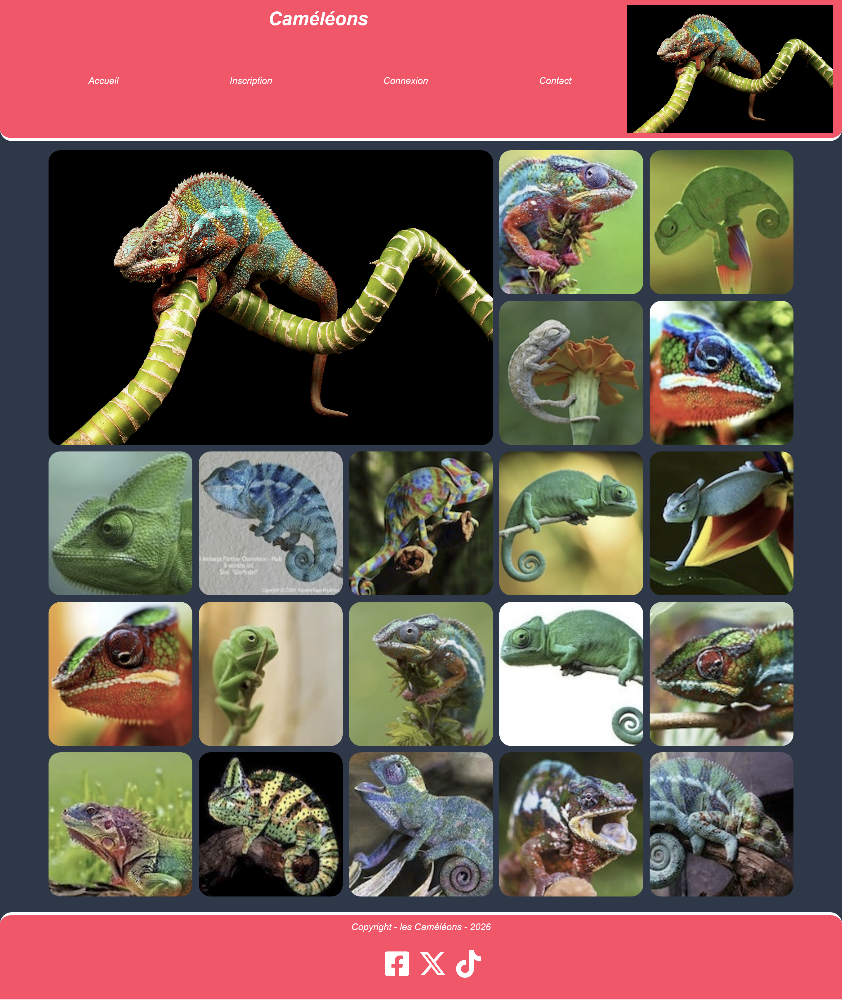

# TD projet 4

Vous avez abordé les problème de media queries. Le but de cet exercice va être de rendre un site prévu pour le format smartphone responsive.

**ON NE TOUCHE PAS AU HTML, NI AU CSS EXISTANT.**

Vous allez juste ajouter des média queries dans le fichier `style.css` pour réaliser les maquettes fournies.

## Le MVP

Commencez par créer une première media query pour le format "tablette" (de 768 à 1023 px). Voici le résultat attendu :

On observe :
- le changement dans le menu du header
- l'apparition d'un logo dans le header
- l'organisation de la galerie de photos sur 3 colonnes
- une bordure sur le haut du footer

## Le Bonus

Cette fois il va falloir s'attaquer au format desktop : au delà de 1024 px.

On observe :
- la galerie passe sur 4 colonnes
- un nouveau menu est apparu dans le footer

## Le Super Bonus

On va encore améliorer notre galerie d'images en faisant apparaître un nouveau caméléon et en faisant disparaître le dernier, le tout sur 5 colonnes :

Il faudra sans doutes bricoler un peu pour que la grande image respecte l'alignement avec les autres...